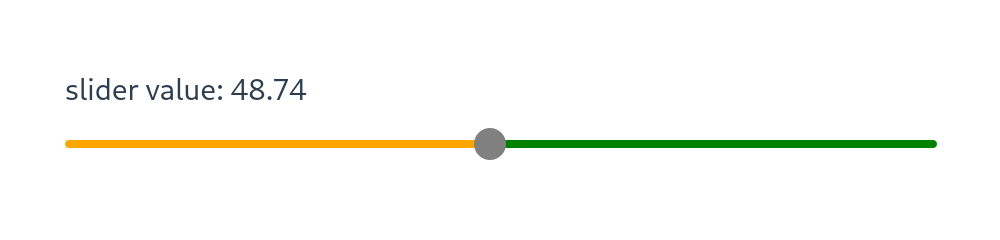

# slider

Vue 3 slider component

[demo](https://moody-person.github.io/vue-slider-component/)



## Installation

``` sh
npm i @asleeppiano/vue-slider
```

## Usage

``` vue
<script setup>
import { ref } from 'vue';
import { VSlider } from '@asleeppiano/vue-slider'
let sliderValue = ref(0);
</script>

<template>
    slider value: {{ sliderValue.toFixed(2) }}
    <v-slider v-model="sliderValue" />
</template>
```
